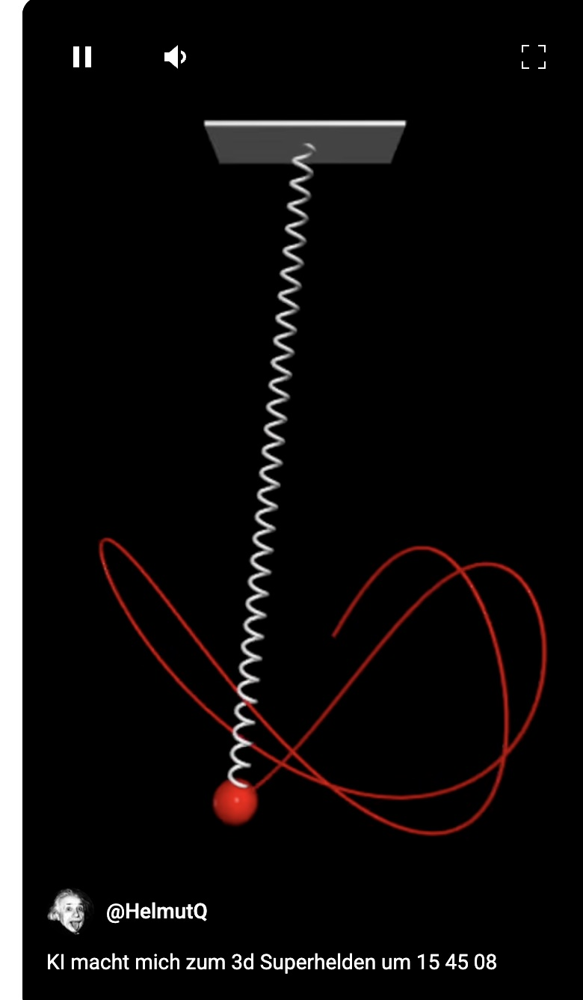

# Mass-Spring Simulation

Online Demo: [Online-demo](https://qualcuno.info/Pendel/)

This project simulates the motion of a mass attached to a spring, taking into account gravity and damping. The simulation uses the VPython library for 3D visualization.

<p align="right" style="float: right; margin-left: 20px;">
    <a href="https://www.youtube.com/shorts/MSY_UUy0_Ds">
        
    </a>
</p>

**Project Website:**

Online Demo: [Online-demo](https://qualcuno.info/Pendel/)
The screenshot on the right shows the 3D visualization of the mass-spring simulation. Click on the image to watch a short video demonstration on YouTube.

## Project Structure

- `pendel.py`: Contains the full code for the mass-spring simulation. Here the physical parameters are defined, the scene is created, and the motion of the mass is calculated and visualized.

## Requirements

To run this simulation you need Python and the VPython library. You can install VPython with pip:

```shell
pip install vpython
```

## Running the Simulation

After installing the requirements, you can run the simulation by starting the `pendel.py` script:

```
python pendel.py
```

This will open a window displaying the mass-spring simulation. You can rotate and zoom the scene with your mouse.

## Customizing the Simulation

In the `pendel.py` script you can adjust various parameters to change the behavior of the simulation:

- `m`: mass of the object
- `k`: spring constant
- `L0`: rest length of the spring
- `g`: gravity vector
- `c`: damping coefficient
- `y0`, `x0`, `z0`: initial displacements of the mass
- `v`: initial velocity of the mass
- `dt`: simulation time step
- `rate()`: controls the speed of animation
- `retain`: number of points retained in the mass's trail

Experiment with these values to observe different oscillation types and damping effects.

## Video Demonstration

A sample demonstration of the simulation can be found on [YouTube](https://www.youtube.com/shorts/MSY_UUy0_Ds).

## Screenshot
<p align="right" style="float: right; margin-left: 20px;">
    <a href="https://www.youtube.com/shorts/MSY_UUy0_Ds">
        
    </a>
</p>
The screenshot on the right shows the 3D visualization of the mass-spring simulation. Click on the image to watch a short video demonstration on YouTube.

## HTML Version

In addition to the Python implementation, a standalone HTML/JavaScript version of the simulation is also available.

### pendel.html

The HTML version uses Three.js for 3D visualization and implements the same physical model as the Python version, but with these additional features:

- No installation required – runs in any modern web browser
- Interactive controls for damping and spring constant
- Ability to push the mass (by clicking or pressing keys)
- Adjustable push strength for dynamic interactions

### Running the HTML Version

To run the HTML version, simply open the `pendel.html` file in a web browser:

```shell
# On macOS
open pendel.html

# Alternatively with a specific browser
firefox pendel.html
chrome pendel.html
```

---

# Masse-Feder-Simulation

Online-Demo: [Online-demo](https://qualcuno.info/Pendel/)

Dieses Projekt simuliert die Bewegung einer Masse, die an einer Feder befestigt ist, unter Berücksichtigung von Gravitation und Dämpfung. Die Simulation verwendet die VPython-Bibliothek zur 3D-Visualisierung.

<p align="right" style="float: right; margin-left: 20px;">
    <a href="https://www.youtube.com/shorts/MSY_UUy0_Ds">
        
    </a>
</p>

**Projekt-Website:** 

Online-Demo: [Online-demo](https://qualcuno.info/Pendel/)
Der Screenshot rechts zeigt die 3D-Visualisierung der Masse-Feder-Simulation. Klicken Sie auf das Bild, um eine kurze Video-Demonstration auf YouTube zu sehen.

## Projektstruktur

- `pendel.py`: Enthält den gesamten Code für die Masse-Feder-Simulation. Hier werden die physikalischen Parameter definiert,
-  die Szene erstellt und die Bewegung der Masse berechnet und visualisiert.
 
## Anforderungen

Um diese Simulation auszuführen, benötigen Sie Python sowie die VPython-Bibliothek. Sie können VPython mit pip installieren:

```shell
pip install vpython
```

## Ausführung der Simulation

Nachdem Sie die Anforderungen installiert haben, können Sie die Simulation ausführen, indem Sie das `pendel.py`-Skript starten:

```
python pendel.py
```

Dadurch wird ein Fenster gestartet, das die Masse-Feder-Simulation anzeigt. Sie können die Szene mit der Maus drehen und zoomen.

## Anpassung der Simulation

Im `pendel.py`-Skript können Sie verschiedene Parameter anpassen, um das Verhalten der Simulation zu ändern:

- `m`: Masse des Objekts
- `k`: Federkonstante
- `L0`: Ruhelänge der Feder
- `g`: Gravitationsvektor
- `c`: Dämpfungskoeffizient
- `y0`, `x0`, `z0`: Anfangsauslenkungen der Masse
- `v`: Anfangsgeschwindigkeit der Masse
- `dt`: Zeitschritt der Simulation
- `rate()`: Steuert die Geschwindigkeit der Animation
- `retain`: Anzahl der Punkte, die in der Spur der Masse beibehalten werden

Experimentieren Sie mit diesen Werten, um verschiedene Schwingungsarten und Dämpfungseffekte zu beobachten.

## Video-Demonstration

Eine Beispiel-Demonstration der Simulation finden Sie auf [YouTube](https://www.youtube.com/shorts/MSY_UUy0_Ds).

## Screenshot
<p align="right" style="float: right; margin-left: 20px;">
    <a href="https://www.youtube.com/shorts/MSY_UUy0_Ds">
        
    </a>
</p>
Der Screenshot rechts zeigt die 3D-Visualisierung der Masse-Feder-Simulation. Klicken Sie auf das Bild, um eine kurze Video-Demonstration auf YouTube zu sehen.

## HTML-Version

Neben der Python-Implementation ist auch eine eigenständige HTML/JavaScript-Version der Simulation verfügbar.

### pendel.html

Die HTML-Version verwendet Three.js zur 3D-Visualisierung und implementiert das gleiche physikalische Modell wie die Python-Version, jedoch mit diesen zusätzlichen Funktionen:

- Keine Installation erforderlich - läuft in jedem modernen Webbrowser
- Interaktive Steuerelemente für Dämpfung und Federkonstante
- Möglichkeit, die Masse anzuschupsen (durch Klicken oder Tasten)
- Einstellbare Schubstärke für dynamische Interaktionen

### Ausführung der HTML-Version

Um die HTML-Version auszuführen, öffnen Sie einfach die Datei `pendel.html` in einem Webbrowser:

```shell
# Unter macOS
open pendel.html

# Alternativ mit einem bestimmten Browser
firefox pendel.html
chrome pendel.html
```

---

# Simulazione Massa-Molla

Demo online: [Demo online](https://qualcuno.info/Pendel/)

Questo progetto simula il movimento di una massa attaccata a una molla, tenendo conto della gravità e dello smorzamento. La simulazione utilizza la libreria VPython per la visualizzazione 3D.

<p align="right" style="float: right; margin-left: 20px;">
    <a href="https://www.youtube.com/shorts/MSY_UUy0_Ds">
        
    </a>
</p>

**Sito del progetto:** 

Demo online: [Demo online](https://qualcuno.info/Pendel/)
Lo screenshot a destra mostra la visualizzazione 3D della simulazione massa-molla. Clicca sull’immagine per vedere una breve dimostrazione video su YouTube.

## Struttura del progetto

- `pendel.py`: Contiene tutto il codice per la simulazione massa-molla. Qui vengono definiti i parametri fisici, creata la scena e calcolato e visualizzato il movimento della massa.

## Requisiti

Per eseguire questa simulazione sono necessari Python e la libreria VPython. Puoi installare VPython con pip:

```shell
pip install vpython
```

## Esecuzione della simulazione

Dopo aver installato i requisiti, puoi avviare la simulazione eseguendo lo script `pendel.py`:

```
python pendel.py
```

Si aprirà una finestra che mostra la simulazione massa-molla. Puoi ruotare e zoomare la scena con il mouse.

## Personalizzazione della simulazione

Nel file `pendel.py` puoi modificare vari parametri per cambiare il comportamento della simulazione:

- `m`: massa dell’oggetto
- `k`: costante elastica della molla
- `L0`: lunghezza a riposo della molla
- `g`: vettore gravità
- `c`: coefficiente di smorzamento
- `y0`, `x0`, `z0`: spostamenti iniziali della massa
- `v`: velocità iniziale della massa
- `dt`: passo temporale della simulazione
- `rate()`: controlla la velocità dell’animazione
- `retain`: numero di punti mantenuti nella traccia della massa

Sperimenta con questi valori per osservare diversi tipi di oscillazione ed effetti di smorzamento.

## Video dimostrativo

Una dimostrazione della simulazione è disponibile su [YouTube](https://www.youtube.com/shorts/MSY_UUy0_Ds).

## Screenshot
<p align="right" style="float: right; margin-left: 20px;">
    <a href="https://www.youtube.com/shorts/MSY_UUy0_Ds">
        
    </a>
</p>
Lo screenshot a destra mostra la visualizzazione 3D della simulazione massa-molla. Clicca sull’immagine per vedere una breve dimostrazione video su YouTube.

## Versione HTML

Oltre all’implementazione Python, è disponibile anche una versione HTML/JavaScript autonoma della simulazione.

### pendel.html

La versione HTML utilizza Three.js per la visualizzazione 3D e implementa lo stesso modello fisico della versione Python, ma con queste funzioni aggiuntive:

- Nessuna installazione richiesta – funziona in qualsiasi browser moderno
- Controlli interattivi per smorzamento e costante elastica
- Possibilità di “spingere” la massa (cliccando o premendo tasti)
- Forza di spinta regolabile per interazioni dinamiche

### Esecuzione della versione HTML

Per eseguire la versione HTML, basta aprire il file `pendel.html` in un browser web:

```shell
# Su macOS
open pendel.html

# In alternativa con un browser specifico
firefox pendel.html
chrome pendel.html
```# Mass-Spring Simulation

Online Demo: [Online-demo](https://qualcuno.info/Pendel/)

This project simulates the motion of a mass attached to a spring, taking into account gravity and damping. The simulation uses the VPython library for 3D visualization.

<p align="right" style="float: right; margin-left: 20px;">
    <a href="https://www.youtube.com/shorts/MSY_UUy0_Ds">
        
    </a>
</p>

**Project Website:**

Online Demo: [Online-demo](https://qualcuno.info/Pendel/)
The screenshot on the right shows the 3D visualization of the mass-spring simulation. Click on the image to watch a short video demonstration on YouTube.

## Project Structure

- `pendel.py`: Contains the full code for the mass-spring simulation. Here the physical parameters are defined, the scene is created, and the motion of the mass is calculated and visualized.

## Requirements

To run this simulation you need Python and the VPython library. You can install VPython with pip:

```shell
pip install vpython
```

## Running the Simulation

After installing the requirements, you can run the simulation by starting the `pendel.py` script:

```
python pendel.py
```

This will open a window displaying the mass-spring simulation. You can rotate and zoom the scene with your mouse.

## Customizing the Simulation

In the `pendel.py` script you can adjust various parameters to change the behavior of the simulation:

- `m`: mass of the object
- `k`: spring constant
- `L0`: rest length of the spring
- `g`: gravity vector
- `c`: damping coefficient
- `y0`, `x0`, `z0`: initial displacements of the mass
- `v`: initial velocity of the mass
- `dt`: simulation time step
- `rate()`: controls the speed of animation
- `retain`: number of points retained in the mass's trail

Experiment with these values to observe different oscillation types and damping effects.

## Video Demonstration

A sample demonstration of the simulation can be found on [YouTube](https://www.youtube.com/shorts/MSY_UUy0_Ds).

## Screenshot
<p align="right" style="float: right; margin-left: 20px;">
    <a href="https://www.youtube.com/shorts/MSY_UUy0_Ds">
        
    </a>
</p>
The screenshot on the right shows the 3D visualization of the mass-spring simulation. Click on the image to watch a short video demonstration on YouTube.

## HTML Version

In addition to the Python implementation, a standalone HTML/JavaScript version of the simulation is also available.

### pendel.html

The HTML version uses Three.js for 3D visualization and implements the same physical model as the Python version, but with these additional features:

- No installation required – runs in any modern web browser
- Interactive controls for damping and spring constant
- Ability to push the mass (by clicking or pressing keys)
- Adjustable push strength for dynamic interactions

### Running the HTML Version

To run the HTML version, simply open the `pendel.html` file in a web browser:

```shell
# On macOS
open pendel.html

# Alternatively with a specific browser
firefox pendel.html
chrome pendel.html
```

---

# Masse-Feder-Simulation

Online-Demo: [Online-demo](https://qualcuno.info/Pendel/)

Dieses Projekt simuliert die Bewegung einer Masse, die an einer Feder befestigt ist, unter Berücksichtigung von Gravitation und Dämpfung. Die Simulation verwendet die VPython-Bibliothek zur 3D-Visualisierung.

<p align="right" style="float: right; margin-left: 20px;">
    <a href="https://www.youtube.com/shorts/MSY_UUy0_Ds">
        
    </a>
</p>

**Projekt-Website:** 

Online-Demo: [Online-demo](https://qualcuno.info/Pendel/)
Der Screenshot rechts zeigt die 3D-Visualisierung der Masse-Feder-Simulation. Klicken Sie auf das Bild, um eine kurze Video-Demonstration auf YouTube zu sehen.

## Projektstruktur

- `pendel.py`: Enthält den gesamten Code für die Masse-Feder-Simulation. Hier werden die physikalischen Parameter definiert,
-  die Szene erstellt und die Bewegung der Masse berechnet und visualisiert.
 
## Anforderungen

Um diese Simulation auszuführen, benötigen Sie Python sowie die VPython-Bibliothek. Sie können VPython mit pip installieren:

```shell
pip install vpython
```

## Ausführung der Simulation

Nachdem Sie die Anforderungen installiert haben, können Sie die Simulation ausführen, indem Sie das `pendel.py`-Skript starten:

```
python pendel.py
```

Dadurch wird ein Fenster gestartet, das die Masse-Feder-Simulation anzeigt. Sie können die Szene mit der Maus drehen und zoomen.

## Anpassung der Simulation

Im `pendel.py`-Skript können Sie verschiedene Parameter anpassen, um das Verhalten der Simulation zu ändern:

- `m`: Masse des Objekts
- `k`: Federkonstante
- `L0`: Ruhelänge der Feder
- `g`: Gravitationsvektor
- `c`: Dämpfungskoeffizient
- `y0`, `x0`, `z0`: Anfangsauslenkungen der Masse
- `v`: Anfangsgeschwindigkeit der Masse
- `dt`: Zeitschritt der Simulation
- `rate()`: Steuert die Geschwindigkeit der Animation
- `retain`: Anzahl der Punkte, die in der Spur der Masse beibehalten werden

Experimentieren Sie mit diesen Werten, um verschiedene Schwingungsarten und Dämpfungseffekte zu beobachten.

## Video-Demonstration

Eine Beispiel-Demonstration der Simulation finden Sie auf [YouTube](https://www.youtube.com/shorts/MSY_UUy0_Ds).

## Screenshot
<p align="right" style="float: right; margin-left: 20px;">
    <a href="https://www.youtube.com/shorts/MSY_UUy0_Ds">
        
    </a>
</p>
Der Screenshot rechts zeigt die 3D-Visualisierung der Masse-Feder-Simulation. Klicken Sie auf das Bild, um eine kurze Video-Demonstration auf YouTube zu sehen.

## HTML-Version

Neben der Python-Implementation ist auch eine eigenständige HTML/JavaScript-Version der Simulation verfügbar.

### pendel.html

Die HTML-Version verwendet Three.js zur 3D-Visualisierung und implementiert das gleiche physikalische Modell wie die Python-Version, jedoch mit diesen zusätzlichen Funktionen:

- Keine Installation erforderlich - läuft in jedem modernen Webbrowser
- Interaktive Steuerelemente für Dämpfung und Federkonstante
- Möglichkeit, die Masse anzuschupsen (durch Klicken oder Tasten)
- Einstellbare Schubstärke für dynamische Interaktionen

### Ausführung der HTML-Version

Um die HTML-Version auszuführen, öffnen Sie einfach die Datei `pendel.html` in einem Webbrowser:

```shell
# Unter macOS
open pendel.html

# Alternativ mit einem bestimmten Browser
firefox pendel.html
chrome pendel.html
```

---

# Simulazione Massa-Molla

Demo online: [Demo online](https://qualcuno.info/Pendel/)

Questo progetto simula il movimento di una massa attaccata a una molla, tenendo conto della gravità e dello smorzamento. La simulazione utilizza la libreria VPython per la visualizzazione 3D.

<p align="right" style="float: right; margin-left: 20px;">
    <a href="https://www.youtube.com/shorts/MSY_UUy0_Ds">
        
    </a>
</p>

**Sito del progetto:** 

Demo online: [Demo online](https://qualcuno.info/Pendel/)
Lo screenshot a destra mostra la visualizzazione 3D della simulazione massa-molla. Clicca sull’immagine per vedere una breve dimostrazione video su YouTube.

## Struttura del progetto

- `pendel.py`: Contiene tutto il codice per la simulazione massa-molla. Qui vengono definiti i parametri fisici, creata la scena e calcolato e visualizzato il movimento della massa.

## Requisiti

Per eseguire questa simulazione sono necessari Python e la libreria VPython. Puoi installare VPython con pip:

```shell
pip install vpython
```

## Esecuzione della simulazione

Dopo aver installato i requisiti, puoi avviare la simulazione eseguendo lo script `pendel.py`:

```
python pendel.py
```

Si aprirà una finestra che mostra la simulazione massa-molla. Puoi ruotare e zoomare la scena con il mouse.

## Personalizzazione della simulazione

Nel file `pendel.py` puoi modificare vari parametri per cambiare il comportamento della simulazione:

- `m`: massa dell’oggetto
- `k`: costante elastica della molla
- `L0`: lunghezza a riposo della molla
- `g`: vettore gravità
- `c`: coefficiente di smorzamento
- `y0`, `x0`, `z0`: spostamenti iniziali della massa
- `v`: velocità iniziale della massa
- `dt`: passo temporale della simulazione
- `rate()`: controlla la velocità dell’animazione
- `retain`: numero di punti mantenuti nella traccia della massa

Sperimenta con questi valori per osservare diversi tipi di oscillazione ed effetti di smorzamento.

## Video dimostrativo

Una dimostrazione della simulazione è disponibile su [YouTube](https://www.youtube.com/shorts/MSY_UUy0_Ds).

## Screenshot
<p align="right" style="float: right; margin-left: 20px;">
    <a href="https://www.youtube.com/shorts/MSY_UUy0_Ds">
        
    </a>
</p>
Lo screenshot a destra mostra la visualizzazione 3D della simulazione massa-molla. Clicca sull’immagine per vedere una breve dimostrazione video su YouTube.

## Versione HTML

Oltre all’implementazione Python, è disponibile anche una versione HTML/JavaScript autonoma della simulazione.

### pendel.html

La versione HTML utilizza Three.js per la visualizzazione 3D e implementa lo stesso modello fisico della versione Python, ma con queste funzioni aggiuntive:

- Nessuna installazione richiesta – funziona in qualsiasi browser moderno
- Controlli interattivi per smorzamento e costante elastica
- Possibilità di “spingere” la massa (cliccando o premendo tasti)
- Forza di spinta regolabile per interazioni dinamiche

### Esecuzione della versione HTML

Per eseguire la versione HTML, basta aprire il file `pendel.html` in un browser web:

```shell
# Su macOS
open pendel.html

# In alternativa con un browser specifico
firefox pendel.html
chrome pendel.html
```